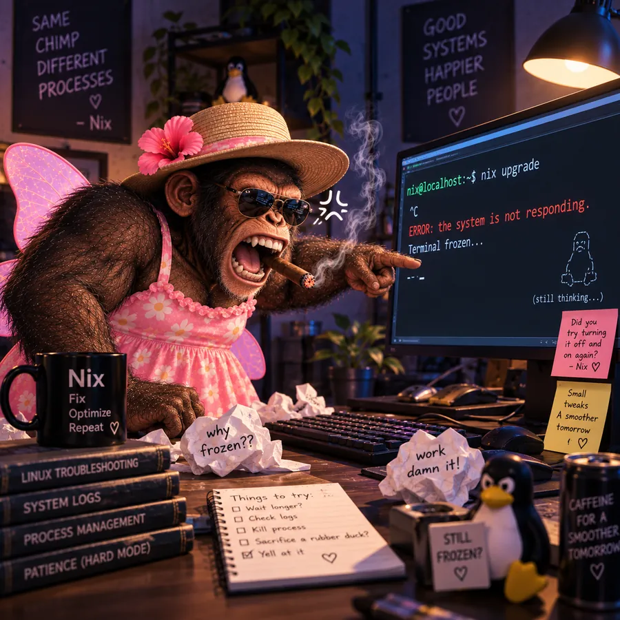

<!-- SPDX-License-Identifier: GPL-3.0-or-later -->

# The portraits

`gallery.html` hangs sixteen plates, and as of now every one of them has been drawn.

This file is how they get drawn without producing sixteen unrelated chimpanzees. The character is the
joke; a gallery of near-misses is just a gallery of different monkeys.

## Where the files live

| | |
| --- | --- |
| `assets/portraits/NN-slug.png` | The render as delivered. Full size, a couple of megabytes each, **never deployed** — `site/` is what Pages publishes, and this is not in it. |
| `site/portraits/NN-slug.webp` | What the page loads. 900px on the long edge, ~100 kB. |

The whole set as PNG is 29 MB, which is twenty times the rest of the site put together. As WebP at
900px it is 1.4 MB, and the plates are displayed in a grid cell about 340 CSS pixels wide — 440
while a pointer is on one — so 900
is already generous. Cut a web copy with:

```sh
convert assets/portraits/09-angry.png -resize 900x900 -quality 80 \
  -define webp:method=6 site/portraits/09-angry.webp
```

`-resize 900x900` fits *within* that box, so a portrait render keeps its shape rather than being
squared off.

## What is locked

Every plate keeps all six of these, in every pose, with no substitutions. If a scene makes one of
them awkward — a wizard in a sundress, a presidential candidate with fairy wings — that awkwardness
*is* the joke, and removing it removes the reason the page exists.

| | Locked description |
| --- | --- |
| **The chimpanzee** | Adult chimpanzee, powerfully built, dark brown fur with a pale grey-white muzzle and chest, heavily photoreal 3D render. Broad open grin showing teeth wherever the pose allows one. |
| **The hat** | Natural straw boater, flat crown, pale cream-gold weave, with a darker woven band. Worn level or slightly back. |
| **The flower** | A single hot-pink hibiscus tucked into the hatband on the wearer's left of the brim, one visible yellow-white stamen. |
| **The sunglasses** | Black aviators, teardrop lenses, thin gold-brown wire frame, near-black lenses with a soft highlight. |
| **The dress** | Pink sundress, white-and-yellow daisy print, ruffled sweetheart neckline, thin ruffled shoulder straps. Where a scene adds a costume — a suit, a robe, a hoodie, a gown — it goes *over* the dress and the dress still shows. |
| **The wings** | Translucent pale-pink fairy wings, two pairs, faintly veined, catching light at the edges. Always visible behind the shoulders. |
| **The cigar** | One lit cigar with a gold-brown band, clamped in the right side of the mouth, with a thin curl of grey smoke rising. |

## The one thing that is not locked

**Nix has no gender, and nothing here is allowed to decide one.** The placards in `gallery.html` say
*he*, `styles.css` says *she*, and both of them are guessing. That is the joke, it is load-bearing,
and a tidy-up commit that unifies the two is the one contribution to this page that would break it.

Which is why the character block below is written without a pronoun — a little stiffly in places, and
on purpose. Say "the shoulders" rather than "his shoulders", and the generator is never told
something the project has spent this much effort not knowing. The costume is fixed; the wearer is
not.

## The house style

The first thirteen plates set this, and it is now as load-bearing as the costume. **These are not
portraits on a plain ground — they are richly dressed sets**, and the set is what makes a wizard and
a fashion model look like the same gallery.

- **Warm, low-key cinematic lighting** against a dark scene. Deep browns, blacks and pinks. The
  mount behind them on the page is dark, and the art bleeds to the edge of its frame.
- **Chalkboards and signs carrying hand-lettered slogans**, somewhere in the background, in the
  scene's own idiom. The established ones are *Same chimp, different processes* · *Good systems,
  happier people* · *A smoother tomorrow* · *Linux freedom, better systems* · *Trust the logs* ·
  *Observe, analyze, optimize, repeat* · *People not problems*. Signing one "— Nix" is in character.
- **Linux paraphernalia dressed into the set**: small Tux penguin figurines, stacked manuals with
  readable spines (`LINUX`, `SYSTEM MONITORING`, `PERFORMANCE TUNING`, `COMMON SENSE`), a black mug
  with `Nix` and a three-word motto under it, a notepad of mostly unticked checkboxes.
- **Square**, unless the scene is genuinely a poster or a full-length shot. Two are not square and
  the page letterboxes them rather than cropping; see the note in `gallery.css`.

## The prompt

Three blocks. Paste the first two unchanged, append the scene, and give the generator one of the
existing plates as an image reference if it accepts one — the reference is what keeps the *face*
consistent, and no amount of wording replaces it.

**Block A, style:**

> Photorealistic 3D character render, cinematic low-key lighting, warm key light, deep shadows,
> shallow depth of field, high detail on fur and fabric. A richly dressed dark set with chalkboard
> signs reading "Same chimp, different processes" and "Good systems, happier people", a small Linux
> penguin figurine, a stack of manuals with readable spines, and a black mug printed with "Nix".
> Square composition, subject centred, no watermark.

**Block B, character:**

> A powerfully built adult chimpanzee with dark brown fur and a pale grey-white muzzle, wearing a
> natural straw boater hat with a single hot-pink hibiscus flower tucked into the band on the left of
> the brim, black aviator sunglasses with thin gold wire frames, and a pink sundress printed with
> white and yellow daisies with a ruffled neckline and thin ruffled straps. Translucent pale pink
> fairy wings spread behind the shoulders. A lit cigar with a gold band is clamped in the right side
> of the mouth with a thin curl of smoke rising.

**Block C, the scene** — from the table below.

## The sixteen

| # | Plate | File | Scene |
| --- | --- | --- | --- |
| 01 | The Default | `01-the-default` | Facing the viewer with a huge open grin, making a peace sign with the right hand. *(The icon artwork; cut from `assets/nix-mascot.png`, not from `assets/portraits/`.)* |
| 02 | System Administrator | `02-system-administrator` | Seated at a desk in an arc of fifteen glowing monitors, every screen scrolling terminal output, hands on the keyboard, leaning in and staring. |
| 03 | The Thinker | `03-the-thinker` | Seated on a stone block, chin resting on one fist in the pose of Rodin's Thinker, a small replica of the statue on a plinth behind. |
| 04 | Victory | `04-victory` | Both fists thrown up in triumph, head back, mid-cheer, a terminal behind reading "Operation completed successfully". |
| 05 | Suspicious | `05-suspicious` | Head tilted down, peering directly at the viewer over the top of the lowered sunglasses, eyes narrowed, beside a notepad of unticked boxes. |
| 06 | Hacker Nix | `06-hacker` | Hunched over a laptop in a dark hoodie worn over the dress, hood up behind the straw hat, face lit by screens of code. |
| 07 | Beach Nix | `07-beach` | Reclining in a deck chair under palms, one arm folded behind the head, beside a signpost reading "Chill mode" and "Systems anywhere". |
| 08 | Wizard Nix | `08-wizard` | In a star-patterned robe and pointed hat worn over the dress, raising a gnarled staff and conjuring a glowing blue sigil of the Linux penguin. |
| 09 | Angry Nix | `09-angry` | Roaring and jabbing a finger at a monitor reading "ERROR: the system is not responding", crumpled notes everywhere, a sticky note answering "Did you try turning it off and on again? — Nix". |
| 10 | Sleepy Nix | `10-sleepy` | Slumped face down and fast asleep across a keyboard, cigar still clamped in the mouth and still smoking, the screen reading "zzz… Process paused. A better tomorrow is still loading". |
| 11 | Corporate Nix | `11-corporate` | A pinstripe suit and tie over the dress, holding a briefcase in a glass-walled office, profoundly weary, a desk nameplate reading "Chief Disappointment Officer". |
| 12 | Final Boss Nix | `12-final-boss` | Enthroned and crowned, enormously muscled, dark wings spread wide, flames rising behind, under a sign reading "Final Boss". |
| 13 | Rastafarian Nix | `13-rastafarian` | A knitted red, gold and green tam and dreadlocks, reclining by the sea, hands behind the head, a sleeping dog alongside. **The one plate that breaks the costume — see below.** |
| 14 | Runway Nix | `14-runway` | Mid-stride down a lit runway in a trailing pink gown, before a crowd of photographers, under signs reading "Style, optimize, automate, dominate". Full length, taller than wide. |
| 15 | Blowing a Kiss | `15-blowing-a-kiss` | Blowing a kiss straight down the lens in a pink feather stole and pearls, a glowing heart in the air, before a wall of flashing cameras. |
| 16 | Vote Nix | `16-vote-nix` | A campaign poster: "VOTE NIX FOR PRESIDENT" over a suited Nix at a podium before a crowd and a domed capitol, with the slogans "Good systems, happier people, a smoother tomorrow". A 2:3 poster, not a square. |

**A warning, because it already happened once.** The first file delivered as `angry_nix.png` was
Corporate Nix — suit, briefcase, *Chief Disappointment Officer* on the nameplate — and nothing in it
was angry. It hangs as `11-corporate`, and the render that is actually angry arrived later. Name a
render for the plate it is going to hang on, not for the prompt you had in mind when you started it.

## Plate 13 is the exception, and it is worth deciding about deliberately

Rastafarian Nix keeps the sunglasses and the cigar. It has **no straw boater, no hibiscus, no fairy
wings and no daisy dress** — a knitted tam, dreadlocks and a printed shirt instead. Four of the six
locked attributes are gone, which is four more than any other plate breaks.

It is a lovely render and the set dressing is exactly on style. But the whole argument of this page
is that sixteen pictures are one mascot, and this is the plate a visitor is least able to place. The
caption leans into it — *"the one plate where the hat comes off"* — which works precisely once. A
second plate that drops the costume and the wall stops being a mascot and starts being a mood board.

If it is ever re-cut, the brief in the scene table stands: **the tam goes over or behind the boater,
not instead of it**, the hibiscus stays in the band, and the wings stay visible. Everything else
about the picture can stay exactly as it is.

Also worth a deliberate decision rather than a default: the shirt carries a large cannabis leaf, and
this is the mascot of a system utility, published on the project's own front door. Nobody has to
mind. It is simply not the sort of thing to ship without having looked at it.

## Hanging one

Every plate is hung, so this is now the procedure for *replacing* one. Drop the PNG in
`assets/portraits/` under the plate's name, cut the WebP into `site/portraits/` with the command
above, and the page picks it up with no edit at all — nothing in `gallery.html` measures the file.

Only a plate going from empty to drawn needs markup. Replace the pending block:

```html
<div class="plate-art is-pending">
  <span class="plate-ghost" aria-hidden="true">09</span>
  <p class="plate-status">Has not sat for this one yet</p>
</div>
```

with the artwork:

```html
<div class="plate-art">
  
</div>
```

Three things that are not optional:

- **The path stays relative.** `src="/portraits/…"` works locally and 404s on GitHub Pages, which
  serves this from a subdirectory. The Pages workflow fails the build on absolute paths for exactly
  that reason.
- **No `width` or `height` on the image.** The frame owns the aspect ratio in `gallery.css`, so there
  is no layout shift to guard against, and a replacement render of a different size cannot break the
  wall. If the render is not square, add `is-uncropped` to the `plate-art` div and it is letterboxed
  on its mount instead of being cropped.
- **The `alt` describes the picture, not the joke.** Somebody using a screen reader gets the caption
  either way; what they cannot get is the drawing. Say what is in it, and quote the signage — the
  lettering in these is half the gag.
- **Wrap the image in a link to its own file.** Each plate opens at full size that way, which is the
  only reason the book spines and sticky notes are readable at all. No JavaScript, no lightbox.
